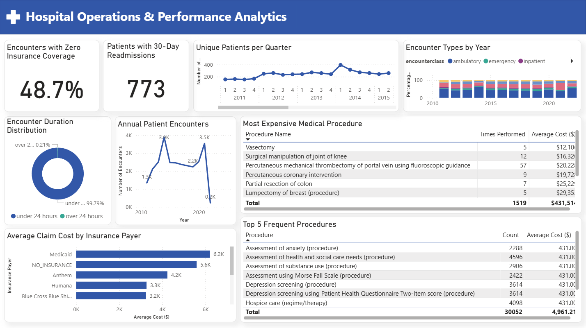

# Healthcare Data Analysis Project

## Problem Statement
A hospital was having trouble understanding their patient visit patterns, costs, and insurance coverage. They needed to figure out why some patients kept coming back frequently and why so many visits weren't covered by insurance.

## Business Objective
To analyze the hospital's patient encounter data and create clear reports showing visit trends, cost patterns, and patient behavior to help improve hospital operations and financial planning.

## My Approach
- **Data Cleaning**: Used SQL to fix date formats, convert data types, and check for data quality issues
- **Data Analysis**: Created 9 key performance indicators (KPIs) to measure important hospital areas
- **Data Collection**: Connected SQL database directly to Power BI to get the cleaned hospital data
- **Data Visualization**: Built a Power BI dashboard to show the findings in an easy-to-understand way

## Tools and Techniques Used
- **SQL**: For data cleaning and analysis
- **Power BI**: For creating charts and dashboards with direct database connection
- **Data Analysis**: Looking for patterns in patient visits and costs

## Key Performance Indicators (KPIs)
1. **Encounters by Year**: Number of patient visits each year
2. **Encounter Types**: Percentage of different visit types (ambulatory, emergency, etc.)
3. **Visit Duration**: How long patients stay (under vs over 24 hours)
4. **Insurance Coverage**: Percentage of visits with no insurance payment
5. **Frequent Procedures**: Most common medical procedures and their costs
6. **Expensive Procedures**: Highest-cost medical procedures
7. **Cost by Payer**: Average costs for different insurance companies
8. **Patient Volume**: Number of unique patients each quarter
9. **Readmissions**: Patients who returned within 30 days

## Dashboard

## Key Insights

### Insight 1: Insurance Coverage Problem
**Finding**: 48.7% of patient visits had no insurance coverage, meaning the hospital didn't get paid for nearly half of their services.

**Business Impact**: This represents a major financial risk for the hospital. When insurance doesn't cover visits, the hospital either absorbs the cost or bills patients directly, which is harder to collect.

**Recommendations**:
- Review why so many visits aren't covered by insurance
- Improve insurance verification before appointments
- Create payment plans for uninsured patients

### Insight 2: Patient Visit Growth
**Finding**: Patient visits grew from 1,336 in 2011 to 3,530 in 2021, showing the hospital is serving more people over time.

**Business Impact**: The hospital is successful at attracting patients, but needs to manage this growth properly to maintain quality care.

**Recommendations**:
- Plan for increasing staff and resources
- Monitor wait times and patient satisfaction
- Consider expanding facilities or services

### Insight 3: Cost Differences by Insurance
**Finding**: Medicaid visits cost the most ($6,205 average) while Medicare visits cost the least ($2,168 average).

**Business Impact**: Different insurance types pay different amounts, which affects hospital revenue and planning.

**Recommendations**:
- Understand why costs vary by insurance type
- Negotiate better rates with insurance companies
- Balance patient mix between different insurance types

### Insight 4: Common vs Expensive Procedures
**Finding**: Routine check-ups and screenings are the most common procedures, while ICU stays and surgeries are the most expensive.

**Business Impact**: The hospital needs both routine visits for steady income and complex procedures for higher revenue.

**Recommendations**:
- Maintain quality in both routine and complex care
- Ensure proper staffing for expensive procedures
- Balance service offerings between common and specialized care

### Insight 5: Readmission Patterns
**Finding**: 773 patients were readmitted within 30 days of their previous visit.

**Business Impact**: Readmissions can indicate quality of care issues and may not be fully covered by insurance.

**Recommendations**:
- Improve discharge planning and follow-up care
- Monitor readmission rates by condition and doctor
- Implement better care coordination for chronic patients

## Summary
This analysis shows that the hospital's main challenges are insurance coverage and managing costs across different types of visits. By connecting SQL directly to Power BI, I created a dashboard that automatically updates with new data, making it easy for hospital staff to monitor these important metrics over time.
